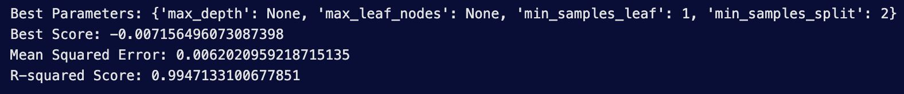

# 
Abhinand Dhandapani

---

## 
Contact Details

- **Current Location:** 17 FORTHVALE COURT, STIRLING, SCOTLAND, FK9 5AL
- **Contact Number:** +44 7407255279
- **Contact Whatsapp:** [+91 7306466576](https://api.whatsapp.com/send?phone=917306466576&text=Hi%20Abhi)
- **Contact Mail:** abhinandd2567@gmail.com

---

## 
 About Me

Hello! I’m Abhinand Dhandapani, an international student from India currently pursuing a Master of Science in Business Analytics at the University of Stirling, Scotland. My journey in the field of commerce has spanned over five years, during which I developed a keen interest in data and its transformative power. This passion for data led me to shift my focus and upgrade my skills by moving to the United Kingdom for advanced studies.

 Read More...

Data has always fascinated me, as it is a fundamental part of our lives from birth to death, influencing every decision we make. This belief has driven me to dive deeper into the world of data analytics, seeking innovative ways to harness its potential.

I am currently seeking a role that will allow me to expand my knowledge and expertise in data management and analytics. I am eager to join a forward-thinking company where I can contribute my skills and continue to learn and grow in the field of data analytics.

<!-- (If you would like to see my long timeline of my life: (https://portfolio.abhinand.xyz/wip)[Click Here]) -->

---

## 
 Skills: 

 Technical 

 
    - SQL
    - Python
    - Power BI
    - Webscraping
    - Data Analytics
    - Data Visualisation

 Management 

    - Project Management
    - Teamwork
    - Communication
    - Story Telling

---

## 
 Personal Projects: 

---

### <u>Data Visualisation:</u>

---
#### Exploring Sleep Health: Key Insights from My Latest Data Analysis 🛌📊

Tools Used: Python

Posted On: [LinkedIn.com](https://www.linkedin.com/posts/abhinand-dhandapani_datascience-sleephealth-lifestyle-activity-7202896732970463232-QXdu?utm_source=share&utm_medium=member_desktop)

**Data Source:** [Kaggle.com](https://www.kaggle.com/)

My recent data exploration delved into the relationships between sleep health and various lifestyle factors.

 Tools & Insights 

### 🔍 Discoveries:
- The dataset included individuals aged 27 to 59, with an average age of 42.
- Sleep duration ranged from 5.8 to 8.5 hours, averaging 7.13 hours.
- The average stress level was 5.39, while the average heart rate was 70.17 bpm.
- Daily steps varied significantly, with an average of 6816 steps.
- A significant difference in sleep duration between genders was found. On average, females tend to have a longer sleep duration in comparison to males. This finding is supported by both the t-test results (p-value = 0.018) and visualised in the accompanying box plot.

### 📊 Correlations:
- Age shows a moderate positive correlation with sleep duration.
- Sleep duration strongly correlates with better sleep quality.
- Physical activity level and daily steps are also closely linked.

These insights, visualised in my charts, highlight the complex relationship between lifestyle choices and sleep health, providing actionable insights for better well-being.

___

#### Analysing the Washers and Dryers in my Accommodation

Tools Used: Python, Power BI

Posted On : [LinkedIn Article](https://www.linkedin.com/pulse/analysing-washers-dryers-my-accommodation-abhinand-dhandapani-clgie/?trackingId=XZsVR7hHYGukb2wo22%2B1Yw%3D%3D)

 Tools & Insights: 

- 🛠️ **Data Source:** Scraped from the accommodation's washer website.
- 📊 **Tools Used:** Data visualized with PowerBI.
- 🔍 **Findings:**
  - **Preferences:** Normal 40°C for washing, Medium for drying.
  - **Issues:** Washer 1 lacks a detergent dispenser; Dryer 8 might have a technical problem.
  - **Best Time:** Late-night (12AM-7AM) to avoid crowds.
  - **Behavior:** Users often leave clothes in machines post-cycle.
- 📱 **Suggestion:** Implement a notification system to alert users when laundry is done.

___

#### Understanding Sales Trend of Retail Shop in Kerala, India

Tools Used: Python, Power BI & SQL

Posted On: [Blogspot](https://abhinanddhandapani.blogspot.com/2024/04/understanding-sales-trend-of-retail.html)

Studying at the University of Stirling enabled me to analyze sales data from my parents' retail shop in Kerala.

 Tools & Insights: 

### 🔍 Findings:
- **Sales Peaks:** April, June, and August due to local festivals.
- **Currency Management:** Determined minimum average currency needed for daily operations.
- **Bad Debts:** Identified percentage and impact.

### 📊 Recommendations:
- Purchase stock a week before festivals.
- Enhance service during peak seasons.
- Reduce number of bad debtors.
- Maintain adequate change in the shop.
- Improve data collection processes.

### 🙏 Personal Thank You:
- **Parents:** For their support.
- **Professors:** For their guidance.

---
### <u>Machine Learning:</u>

---
#### Predicting Population Growth in the United Kingdom 🌍📈

Tools Used: Python

Posted on: [LinkedIn.com](https://www.linkedin.com/posts/abhinand-dhandapani_datascience-populationgrowth-predictivemodeling-activity-7203259120664092672-Hi1g?utm_source=share&utm_medium=member_desktop)

**Data Source:** [Kaggle.com](https://www.kaggle.com/)

Using data from 1960-2022 from Kaggle, I developed models to predict population trends. These insights help understand future population growth. Here are the findings:

 Tools & Insights: 

- **📅 Data Range:** 1960-2022
- **🔎 Models Used:** Decision Tree, Linear Regression
- **🥇 Top Model:** Decision Tree
- **📊 Decision Tree R-squared Score:** 0.9947
- **📊 Linear Regression R-squared Score:** 0.9082

### 🔎 Insights:
- Decision Tree outperformed Linear Regression.
- Effective in predicting future population trends.

**Parameters & Results:**

---
## 
 Certifications 

- "Power BI Essential Training” by Gini von Courter
<!-- - Poster Presentation of GST - 1st Price - SKASC, Coimbatore -->
